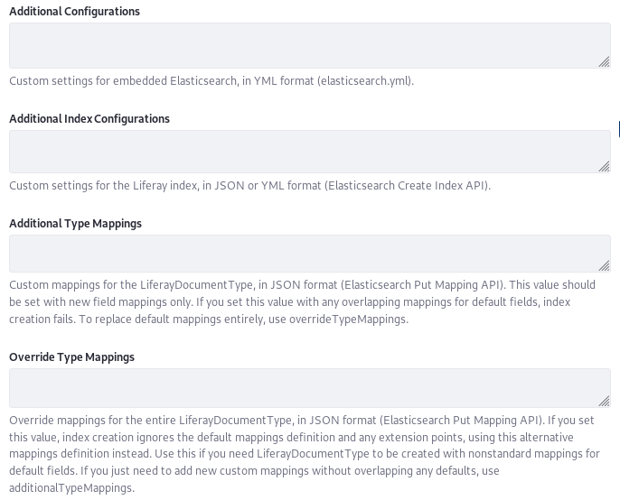

# Liferay Elasticsearchコネクタの高度な設定 

[TOC levels=1-4]

LiferayのElasticsearchアダプタモジュールのデフォルト設定は、`ElasticsearchConfiguration`というJavaクラスに設定されています。

Elasticsearchアダプターにはデフォルトで様々なオプションが含まれていますが、それでも必要な設定オプションが見つからない場合もあります。このような場合、設定オプションを追加することもできます。Elasticsearchで設定可能な場合は、Elasticsearchアダプターを使って設定することができます。す。 

## LIFERAY ELASTICSEARCH アダプターに設定とマッピングを追加する

使用可能な構成オプションは、2つのグループに分かれていると考えてください。簡単に構成できる最も一般的なもの、およびより複雑な構成より強引なアプローチが必要です。必要な設定がデフォルトで利用できない場合でも、Liferay Elasticsearchアダプターを使用して設定できます。
`additionalConfigurations`、
`additionalIndexConfigurations`、または`additionalTypeMappings`、および
`overrideTypeMappings`設定を、少なくとも1つ以上必要です。

### 追加設定

`additionalConfigurations`は、EmbeddedモードのElasticsearchのための追加設定を（YAMLで）定義します。これはEmbeddedモードのElasticsearchサーバーを使用したテスト環境でのみ役に立ちます。通常`elasticsearch.yml`で設定されているノード設定はすべてここで宣言できます。全ての可能なノード設定の説明については、[Elasticsearchの資料](https://www.elastic.co/guide/en/elasticsearch/reference/6.5/index.html)を参照してください 。

### インデックス追加の設定

`additionalIndexConfigurations`は、作成時に@product@インデックスに適用される追加設定を（JSONまたはYAMLで）定義します。たとえば、この設定を使用してカスタムアナライザとフィルタを作成できます。使用可能な設定の完全なリストについては、[Elasticsearchのリファレンス](https://www.elastic.co/guide/en/elasticsearch/reference/6.5/index-modules.html)を参照してください。

以下は、動的テンプレートに適用できる[分析](https://www.elastic.co/guide/en/elasticsearch/guide/current/analysis-intro.html#analysis-intro)の構成方法を示す例です （[以下](#overriding-type-mappings)を参照）。

    {
    "analysis": {
    "analyzer": {
    "kuromoji_liferay_custom": {
    "filter": [
    "cjk_width",
    "kuromoji_baseform",
    "pos_filter"
    ],
    "tokenizer": "kuromoji_tokenizer"
    }
    },
    "filter": {
    "pos_filter": {
    "type": "kuromoji_part_of_speech"
    }
    }
    }
    }

### Adding Type Mappings

`additionalTypeMappings`は、`LiferayDocumentType`型定義のための追加のフィールドマッピングを定義します。これらはインデックスが作成されたときに適用されます。JSONシンタックスを使用して、これらのフィールドマッピングを追加します。詳しくは[こちら](https://www.elastic.co/guide/en/elasticsearch/reference/6.5/mapping.html) と [こちら](https://www.elastic.co/guide/en/elasticsearch/reference/6.5/indices-put-mapping.html)をご覧ください 。
 新しいフィールドマッピングに`additionalTypeMappings`を使用しますが、既存の`properties`マッピングは上書きしないでください。ここで設定した`properties`マッピングのいずれかが既存のマッピングと重複すると、インデックスの作成は失敗します。`overrideTypeMappings`をデフォルトのpropertiesマッピングを置き換えるために使用してください。

動的テンプレートと同様に、@product@の型マッピングにサブフィールドマッピングを追加できます。Elasticsearchではこれらはプロパティと呼ばれています。

    {
    "LiferayDocumentType": {
    "properties": {
    "fooName": {
    "index": "true",
    "store": "true",
    "type": "keyword"
    }
    }
    }
    }

Elasticsearchのフィールドのデータ型の詳細については、[こちら](https://www.elastic.co/guide/en/elasticsearch/reference/6.5/mapping-types.html)を参照してください 。

上記の例は、@product@の型マッピングに`fooName`フィールドを追加する方法を示しています。`fooName`はマッピング内の既存のプロパティではないため、正常に機能します。既存のプロパティマッピングを上書きしようとすると、インデックスの作成は失敗します。代わりに、マッピングで`properties`を上書きするために`overrideTypeMappings`設定を使用してください。

追加のマッピングが`LiferayDocumentType`に追加されたことを確認するには、追加を保存し、インデックスを再作成した後に、`curl`を使用して、このURLにアクセスします。

    curl http://[HOST]:[ES_PORT]/liferay-[COMPANY_ID]/_mapping/LiferayDocumentType?pretty

これはElasticsearchインスタンスが`localhost:9200`で実行され、@product@ Company IDが`20116`に設定されている例です。

    curl http://localhost:9200/liferay-20116/_mapping/LiferayDocumentType?pretty

上記のURLでは`liferay-20116`がインデックス名です。これを含めると、その名前のインデックスを作成するために使用されたマッピングを表示したいことを示します。

### Overriding Type Mappings

`overrideTypeMappings`は、@product@のデフォルトの型マッピングを上書きするために使用します。これは高度な機能であり、どうしても必要な場合にのみ使用します。この値を設定すると、@product@のソースコードでLiferayドキュメントタイプを定義するために使用されるデフォルトのマッピング（例：`liferay-type-mappings.json`）は完全に無視されるため、変更するセグメントだけではなく、マッピングの定義全体をこのプロパティに含めます。変更するには、URLに移動してインデックスの作成に使用されている現在のマッピングのリスト全体を探します。

    http://[HOST]:[ES_PORT]/liferay-[COMPANY_ID]/_mapping/LiferayDocumentType?pretty

このプロパティの値としての内容を（システム設定またはOSGi設定ファイルに）コピーします。左側の中括弧`{`はそのままにしますが、2〜4行目を完全に削除します。

    "liferay-[COMPANY_ID]": {
    "mappings" : {
    "LiferayDocumentType" : {

次に、マッピングの最後から、最後の3つの中括弧を削除します。

    }
    }
    }

この時点で、適切なマッピングを変更します。変更を保存してServer Administrationからのインデックスの再作成を実行すると、変更が有効になります。

以下は、`additionalIndexConfigurations`の分析設定を使用して、 [_ja](https://www.elastic.co/guide/en/elasticsearch/reference/6.5/dynamic-templates.html)で終わるすべての文字列フィールドを分析する`動的テンプレート`の例です。これをすべての
他のデフォルトのマッピング、提供されている`template_ja `をこのカスタムに置き換えます
：

    {
    "LiferayDocumentType": {
    "dynamic_templates": [
    {
    "template_ja": {
    "mapping": {
    "analyzer": "kuromoji_liferay_custom",
    "index": "analyzed",
    "store": "true",
    "term_vector": "with_positions_offsets",
    "type": "string"
    },
    "match": "\\w+_ja\\b|\\w+_ja_[A-Z]{2}\\b",
    "match_mapping_type": "string",
    "match_pattern": "regex"
    }
    ...
    }
    ]
    }
    }

## マルチラインYML設定

OSGiの設定ファイルを使って先程の設定を行った場合は、数行にわたるYAMLスニペットを書く必要がある場合もあります。シンタックスは各行にの最後に`\n\`を追加するのみです。 

    additionalConfigurations=\
    cluster.routing.allocation.disk.threshold_enabled: false\n\
    cluster.service.slow_task_logging_threshold: 600s\n\
    index.indexing.slowlog.threshold.index.warn: 600s\n\
    index.search.slowlog.threshold.fetch.warn: 600s\n\
    index.search.slowlog.threshold.query.warn: 600s\n\
    monitor.jvm.gc.old.warn: 600s\n\
    monitor.jvm.gc.young.warn: 600s

単純な設定から既存の型マッピングの上書きまで、ElasticsearchとLiferayのElasticsearchへのコネクタで設定可能です。
